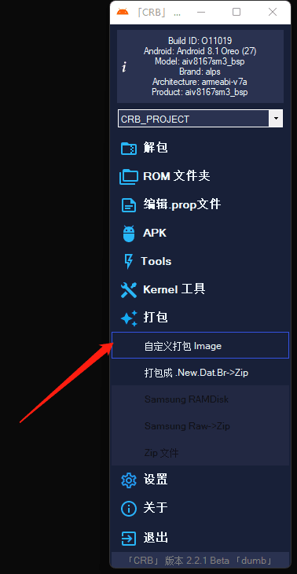

# 天猫精灵cc  小度在家通用破解教程

**本教程于网络收集，与本人无关，若有侵权请联系本人删除**
1.撕开后面电源贴纸，露出USB接口，UBS口在贴片底下

2.配置环境，以WIN10为例。
1.安装UsbDk驱动
直接打开UsbDk_1.0.22_x64.msi安装，安装过程中会出现鼠标键盘等外设无法使用的情况，不用慌张，等它安装完成就好了。一闪而过很快就装好了
 

3.备份system.bin，boot.bin镜像
1.打开MTK_Client,用数据线连接天猫精灵和电脑，将天猫精灵关机并长按上方静音键和开机键直到显示分区列表，如下图：

 此图是上方的静音键和开机键
此图是分区列表

2. 选system和boot分区并备份 
   

   

   

3.	将读出来的system.bin改成system.img
4.	将apk软件添加到system.img镜像
1、	打开crb_v221b文件夹，双击CRBuilder.exe
2、	选择解包
如果软件是英文，点setting，最上面的language，点第一个chinese，然后点下面的apply。就变中文了。
 

先点击Create创建项目，再点击Select File按钮选择mtkclient-main 文件夹里面的system.img文件，最后点击底部的解压按钮
 

解压完成之后点击右下角按钮打开文件夹
 

3、	依次打开system文件夹，再打开app文件夹，删除xiaoxiaoyouku文件夹。AliTvYingshi我也删了，不影响，删除是腾出空进给新的APP，不要乱删。
把教程里的APP文件夹复制到SYSTEM的文件夹里面。
选择打包-自定义打包Image
 

选项按下图默认即可，不要乱动这里，尤其的镜像大小，不然开机会进FASTboot模式，然后点击下方的构建按钮
 

点击右下角输出目录
 

得到修改后的system.img文件
 

解bl锁【解锁后才能刷包，】
 

4.将system.bin文件刷入机器
1.天猫精灵连接MTK_Client后写system
 

2.	写好之后拔掉数据线和电源线，再将电源线重新接入，机器会自动重启，过一会儿会进入第当贝桌面，不要着急，可能有点慢
进入当贝桌面之后先看系统文件夹里有没有权限狗，小白点，面具，es文件管理器这四个应用（注：如果上面软件不全的话，可以在设置里面选择恢复出厂设置，选择保留网络设置和账号信息）
 

打开小白点初始化，方便以后切换桌面
 1. 修补boot并刷入boot获取root权限
 2. 将之前提取出来的boot.bin改名为boot.img并通过面具软件修补
 3. 天猫精灵连接MTK_Client后写boot
 

 4. 写好之后拔掉数据线和电源线，再将电源线重新接入，机器会自动重启，过一会儿会进入第当贝桌面
 5. 打开es文件管理器，打开root工具箱，如果弹出这个对话框，就说明已经获取root权限如果没有重新写入boot
 

 6. 打开权限狗工作模式选择root，他需要超级权限就允许
左上角三个点点一下打开包含系统应用再找到ES文件浏览器 
点开之后找到请求安装文件包，允许这个权限
 

 7. 安装第三方应用
打开es文件管理器，开启远程管理器在电脑文件管理器上面可以输入地址
直接传文件到天猫精灵上，通过ES文件管理器就可以安装
也可以安装其他的应用商城，同理在权限狗打开安装权限